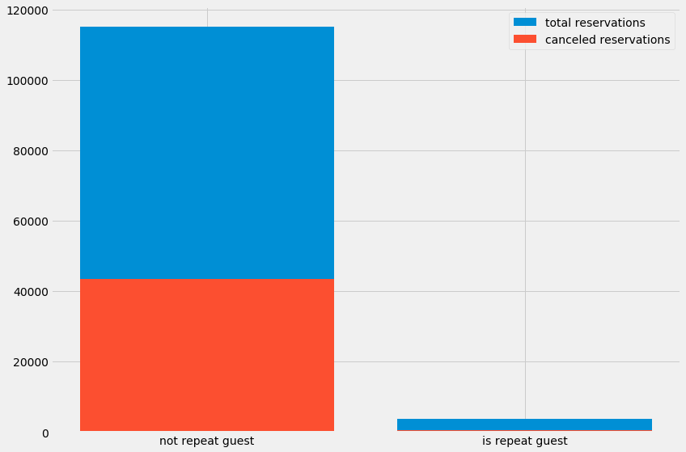
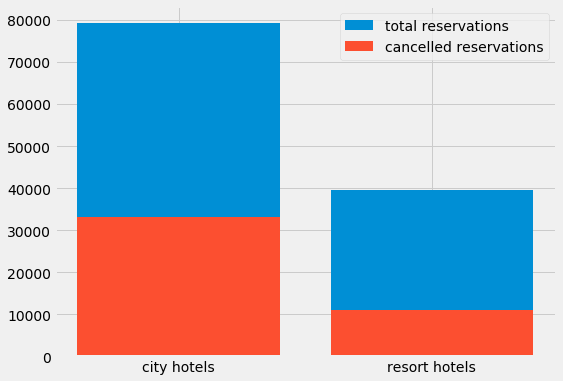
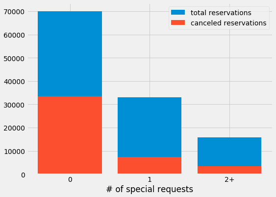
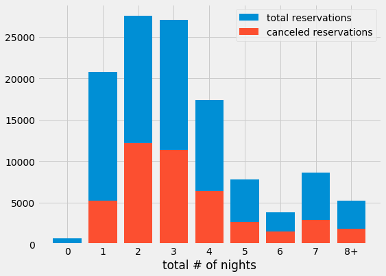
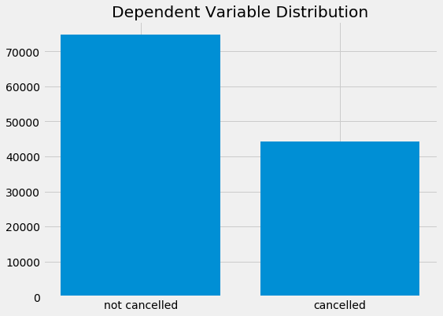
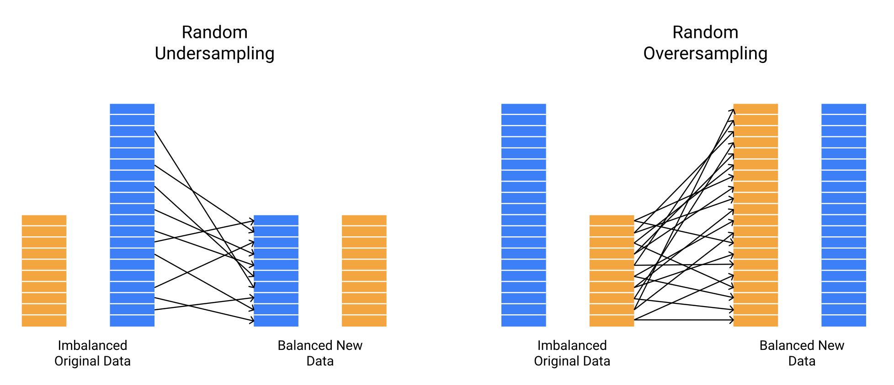
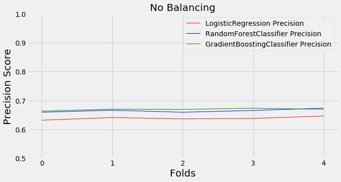

# Predicting Hotel Cancellations
Using machine learning to predict hotel reservation cancellations to maximize profit.

# About the data
This dataset was created as part of an open hotel booking dataset from [Antonio, Almeida and Nunes, 2019](https://www.sciencedirect.com/science/article/pii/S2352340918315191#f0010). I originally found it on the `tidytuesday` page on GitHub. A full description of the dataset can be found [here](https://github.com/rfordatascience/tidytuesday/blob/master/data/2020/2020-02-11/readme.md). 

There was relatively little cleaning that I had to do for this dataset. I did, however, choose to conduct some feature engineering in order to create some new, more descriptive features. They are listed below:
- `total_nights`: this combined the `stays_in_weekend_nights` and `stays_in_week_nights` features.
- `party_size`: this combined the `adults`, `children`, and `babies` columns.
-  `is_family`: a boolean column I created using `adults`, `children`, and `babies`.
- `room_difference`: a boolea column combining `reserved_room_type` and `assigned_room_type` indicating if there was a difference between the guest's reserved and assigned rooms.

# EDA
I conducted some exploratory data analysis to try and determine which features contain the most signal in the data. These features will be the strongest indicators of whether or not a cancellation will occur.

  

There is a lot of signal in this data, which is to be expected given that the split is occurring on prior stays at the same hotel. Unfortunately, because the data is so imbalanced this feature may not be the best one to use, since the vast majority of the data will fall into one category. I will reserve it for now and perhaps add it in later on.

  

  

  

These graphs all feature quite a bit of signal in the data, and these features are more balanced than the `is_repeat_guest` feature. For my baseline model, I'll use these features and a few others.

  

There is a bit of a class imbalance in the dependent variable, `is_canceled`. I will take this into account when training my models by empirically choosing a balancing method (undersampling, oversampling, SMOTE, etc.) to apply to my data before training.

# Data Adjustments
The imbalance in the classes is not extreme, but it is not insignficant. Thus, any model that I use will tend to skew towards the majority class simply because it is represented more frequently in the data. I don't want the *amount* of data to unduly influence a classification, I want the patterns in the features of the data to be the determining factor when classifying.

  

One method of accounting for a class imbalance in the data is to use **undersampling**. The concept behind undersampling is to randomly exclude some data in the majority class from the training set, so that the class distribution of the data follows an even 50/50 split. The key problem with undnersampling is that you end up with less data overall, which is never ideal.

Another method of accounting for imbalance is to use **oversampling**. Oversampling works in a very similar manner to undersampling, the key difference being that in this case data from the minority class is randomly duplicated to match the number of observations in the majority class. While this helps prevent scarcity of data being a problem as in undersampling, another issue presents itself: the presence of duplicate data in the minority class may improperly influence the model.

**SMOTE** (Synthetic Minority Oversampling Technique), is a method of balancing that seeks to fix the problem with oversampling. Rather than randomly duplicating data in the minority class, SMOTE algorithmically creates synthetic data from the minority class, so that the presence of duplicates does not unduly weight the model.

In the original SMOTE paper, the authors recommended trying a combination of SMOTE and undersampling, so I will try that as well.

# Baseline Model
At this point I decided to establish a baseline out-of-the-box model. I will compare several different types of balancing in combination with several different types of machine learning models to get an idea for which model and balancing method works best. I'm going to use a limited number of features in order to keep runtime down and because I am not doing major feature analysis yet.

The features I used are:
- `hotel`
- `market_segment`
- `num_special_requests`
- `total_nights`
- `room_difference`

The methods of balancing I used are:
- None
- Random Undersampling
- Random Oversampling
- SMOTE
- SMOTE + Random Undersampling

I will be using precision as the primary evaluation metric for these tests, since misclassifying a non-cancelling guest into the `cancelled` category is much more serious of an error than misclassifying a cancelling-guest into the `not cancelled` category. Essentialy, I want to maximize true positives while minimizing false positives. Precision is the metric that best represents this ratio.

  

Not balancing the data actually proved to be the most effective strategy in this case, so I will move forward using this. If there's time later on, I'll come back and try to tune the balancers.