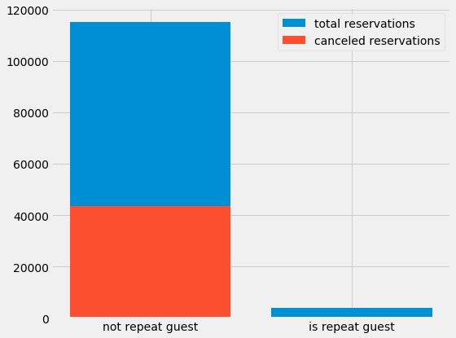
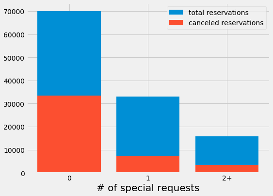
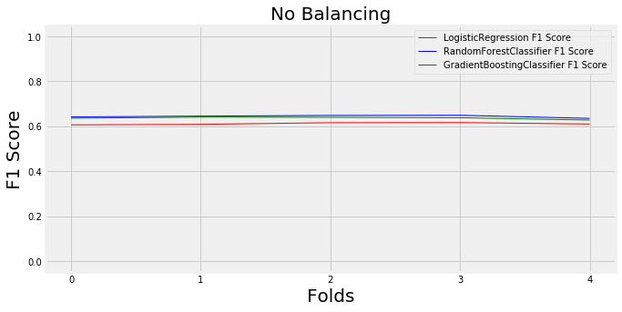
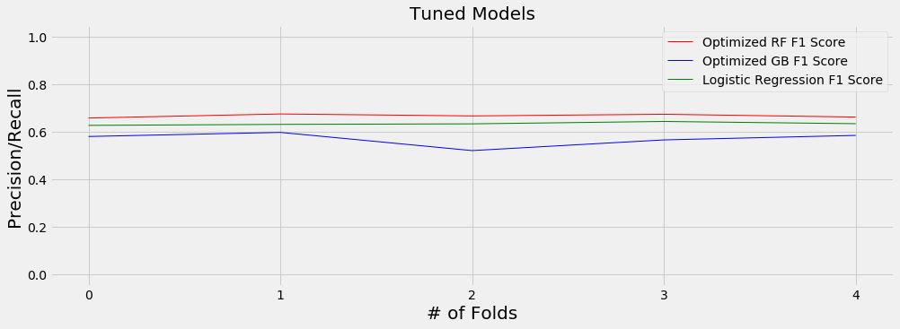
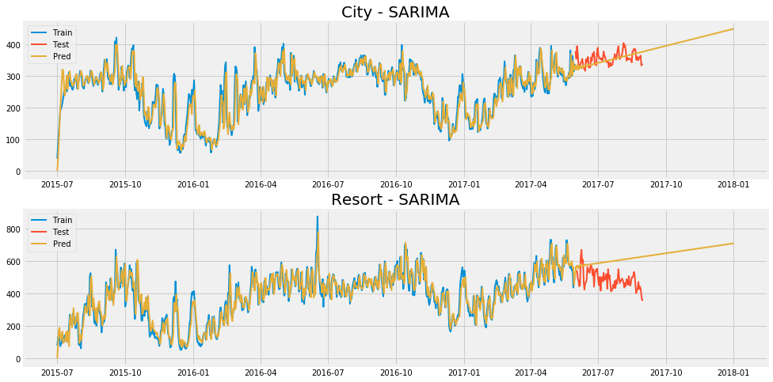
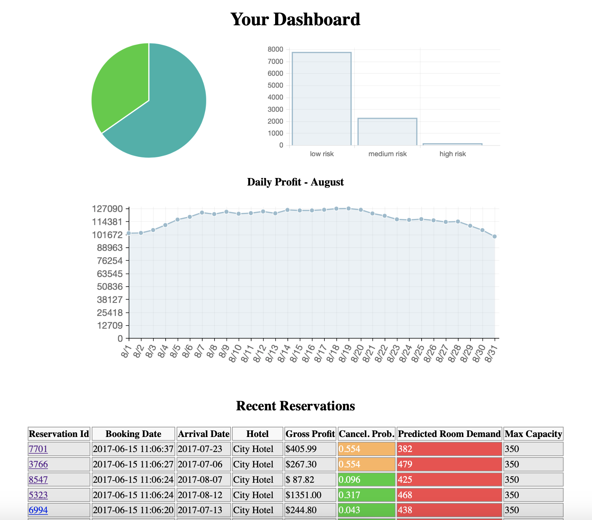

# Predicting Hotel Cancellations
Using machine learning to predict hotel reservation cancellations to maximize profit.

# About the data
This dataset was created as part of an open hotel booking dataset from [Antonio, Almeida and Nunes, 2019](https://www.sciencedirect.com/science/article/pii/S2352340918315191#f0010). I originally found it on the `tidytuesday` page on GitHub. A full description of the dataset can be found [here](https://github.com/rfordatascience/tidytuesday/blob/master/data/2020/2020-02-11/readme.md). 

There was relatively little cleaning that I had to do for this dataset. I did, however, choose to conduct some feature engineering in order to create some new, more descriptive features. They are listed below:
- `total_nights`: this combined the `stays_in_weekend_nights` and `stays_in_week_nights` features.
- `party_size`: this combined the `adults`, `children`, and `babies` columns.
-  `is_family`: a boolean column I created using `adults`, `children`, and `babies`.
- `room_difference`: a boolea column combining `reserved_room_type` and `assigned_room_type` indicating if there was a difference between the guest's reserved and assigned rooms.

# Part 1: Predicting Cancellations
## EDA
I conducted some exploratory data analysis to try and determine which features contain the most signal in the data. These features will be the strongest indicators of whether or not a cancellation will occur.

  

There is a lot of signal in this data, which is to be expected given that the split is occurring on prior stays at the same hotel. Unfortunately, because the data is so imbalanced this feature may not be the best one to use, since the vast majority of the data will fall into one category. I will reserve it for now and perhaps add it in later on.

  

  

  

These graphs all feature quite a bit of signal in the data, and these features are more balanced than the `is_repeat_guest` feature. For my baseline model, I'll use these features and a few others.

  

There is a bit of a class imbalance in the dependent variable, `is_canceled`. I will take this into account when training my models by empirically choosing a balancing method (undersampling, oversampling, SMOTE, etc.) to apply to my data before training.

## Data Adjustments
The imbalance in the classes is not extreme, but it is not insignficant. Thus, any model that I use will tend to skew towards the majority class simply because it is represented more frequently in the data. I don't want the *amount* of data to unduly influence a classification, I want the patterns in the features of the data to be the determining factor when classifying.

  

One method of accounting for a class imbalance in the data is to use **undersampling**. The concept behind undersampling is to randomly exclude some data in the majority class from the training set, so that the class distribution of the data follows an even 50/50 split. The key problem with undnersampling is that you end up with less data overall, which is never ideal.

Another method of accounting for imbalance is to use **oversampling**. Oversampling works in a very similar manner to undersampling, the key difference being that in this case data from the minority class is randomly duplicated to match the number of observations in the majority class. While this helps prevent scarcity of data being a problem as in undersampling, another issue presents itself: the presence of duplicate data in the minority class may improperly influence the model.

**SMOTE** (Synthetic Minority Oversampling Technique), is a method of balancing that seeks to fix the problem with oversampling. Rather than randomly duplicating data in the minority class, SMOTE algorithmically creates synthetic data from the minority class, so that the presence of duplicates does not unduly weight the model.

In the original SMOTE paper, the authors recommended trying a combination of SMOTE and undersampling, so I will try that as well.

## Baseline Model
At this point I decided to establish a baseline out-of-the-box model. I will compare several different types of balancing in combination with several different types of machine learning models to get an idea for which model and balancing method works best. I'm going to use a limited number of features in order to keep runtime down and because I am not doing major feature analysis yet.

The features I used are:
- `hotel`
- `market_segment`
- `num_special_requests`
- `total_nights`
- `room_difference`

The methods of balancing I used are:
- None
- Random Undersampling
- Random Oversampling
- SMOTE
- SMOTE + Random Undersampling

My evaluation metric will be the f1-score.

  

Not balancing the data actually proved to be the most effective strategy in this case, so I decided to move forward with the data as is. It is likely that this is the case because the data is not too imbalanced.

## Hyperparameter Tuning
After determining that the data did not need any rebalancing before training on the models, I decided to move forward and began hyperparameter tuning my models. I chose to tune both the Random Forest Classifier and the Gradient Boosting Classifier. Again, my evaluation metric was the f1-score.

  

With an f1-score of ~0.68, the Random Forest Classifier was the best model over the Gradient Booster or Regression models.

## Results
Before looking at the results, I decided to find which features were the most important in determining cancellations. There are two ways of gauging a feature's importance in ensemble methods like Random Forests: *mean decrease impurity* and *mean decrease accuracy*.

  

Mean decrease impurity (`mdi`) determines a features importance by recording the decrease in impurity that occurs at each branch in a tree and the feature it is associated with. These values are averaged by feature across all trees in the ensemble model. The features with the highest average impurity decrease are the ones that are used most often in decision making by the model. The one downside of mean decrease impurity comes with continues quantitative variables. These types of features are more likely to have a higher cardinality--or presence--than their actual importance. In this case, I don't have to worry about that as much because I am treating all of my numerical variables as categorical.

  

Mean decrease accuracy (`mda`) determines a feature's importance by recording the decrease in accuracy that occurs when a feature is either removed entirely or scrambled so as to become meaningless. This is typically much more computationally expensive than calculating `mdi`, especially in datasets with a high-dimensional featurespace. However, it is less prone to cardinality, which makes it a valuable gauge of importance when computed.

Across both `mdi` and `mda` the most important features are pretty similar and there is not anything completely absurd, which is reassuring. Interestingly enough, the most important features are ones like `total_of_special_requests` and `room_difference`, which provide a sense of how much care and attention the guest put into the reservation. Perhaps guests are more likely to follow through on their trips when they are able to better plan them out beforehand. If a hotel wants to reduce the number of reservations that turn into cancellations, perhaps they should redesign their reservation process in a way that allows the guests to pay more attention to the minute details of their trip.

  

The receiver operating characteristic (ROC) curve compares the true positive rates and false positive rates for the models at different discrimination thresholds, and it is very useful when determining which model is best. In this case, the Random Forest Classifier is the best with an area under curve (AUC) value of 0.82, which tells us that the model has an 82% chance of correctly classifying cancellations.

Of course, this classification problem has a real business case, so the best way to quantify how successful the model is is to create a cost-benefit matrix and plot a profit curve. A cost-benefit matrix can be used to show the costs and profits associated with the 4 possible outcomes in a binary classification problem: true positives, false positives, true negatives, and false negatives.

**Note:** Without real financial data, this portion of the project is largely speculative. However, it is a fun exercise in testing models against a business case.

After looking at the data I found that on average each room costs ~$103 and the median number of nights stayed by a guest is 3. So a typical reservation will make the hotel $306 in gross profit. However, in reality, anywhere from 40-60% of a hotel's gross profit is eaten up by expenses, and these expenses will occur whether or not a room is booked. Assuming a revenue of 40% from gross profit, the hotel can expect to make $123/stay, meaning that $183 go towards expenses.

A `true positive` occurs when the model correctly predicts that a guest will cancel. In this situation, I assume that the hotel will double-book the room and will take in $123 in revenue.

A `false positive` occurs when the model predicts that a guest will cancel and they do not. Assuming that the hotel double-books whenever the model predicts a cancellation, this is the worst-case scenario. In this case, the guest will leave the hotel a bad review, which will deter 10 other guests from staying there, meaning that the lost revenue is $1830.

A `true negative` occurs when the model correctly predicts that a guest will not cancel. This is the norm and the hotel makes $123 in revenue.

A `false negative` occurs when the model predicts the guest will not cancel and they actually do. In this case, the hotel makes no profit but still has to pay the expenses associated with each room.

|                    | Predict Cancel | Predict No Cancel |
|--------------------|----------------|-------------------|
|  Actually Cancel   |      $123      |       -$183       |
| Actually No Cancel |     -$1830     |        $123       |

  

Rather than using an ideal discrimination threshold from the ROC curve, I can instead choose a discrimination threshold that best fits my cost-benefit matrix, since the hotel is interested in maximizing profit. The random forest model computes probabilities that a reservation is a cancellation, by applying my cost-benefit matrix to the distribution of true and false positives and negatives at different discrimination thresholds I can identify the best one. In this case, a threshold of 0.81 results in the highest amount of profit. This threshold is particularly high because the cost-benefit matrix is weighted so negatively towards false positives. Have multiple false negatives is substantially less expensive than having false positives.

  

This confusion matrix for the test dataset confirms that. Many of the true cancellations are predicted as being non-cancellations because the acceptance threshold for a cancellation is so high.

# Part 2: Forecasting Demand
## EDA
In the second part of this project I focused on predicting demand. For the sake of simplicity I decided to assume that there were only two hotels: the resort hotel and the city hotel.

  

This chart shows a moving 3-day average of room occupancies for non-cancellations. These values allow me to actually figure out how many rooms total were available on any given day. The resort hotel appears to have somewhere between 225-250 units, while the city hotel has 300-350 rooms available on any given day.

  

This chart adds all of the canceled reservations to the previous ones, showing that already there is probably some overbooking going on. There is also some distinct seasonality in these charts. November through January seems to be the offseason, with the one notable exception in this time frame being the holidays.

  

Breaking the trend lines down into their components better lets us see this seasonality as well as any other long-term trends. The data for the resort is much more obviously seasonal than the data for the city, which is intuitive. People are far more likely to plan a city-based vacation at any point during the year than they are to plan a resort-based one.

  

## Baseline
At this point I'm going to establish a baseline. Although the dataset is relatively small, the baseline prediction for any day will be the average number of rooms occupied on that day in all previous years, taking into account the linear trend of the hotel. I am going to reserve a 3-month window at the end of the data to be used as test data in order to compute RMSE scores, but I will also forecast to the end of the year to see how the predictions look.

  

## SARIMA
In addition to the baseline I decided to try my hand at using a SARIMA model. Without going too into the weeds, here are the parameters I used:
|     | Resort | City |
|-----|--------|------|
| `p` |   6    |   6  |
| `d` |   1    |   1  |
| `q` |   5    |   6  |
| `m` |   1    |   1  |

  

## Facebook Prophet
I also decided to try using Facebook's prophet model. Unfortunately, Prophet is a black box model so there is not much I can say about the inner workings of it.

  

## Results
I trained the models using the full reservations set, as opposed to just the non-cancellations. The reasoning behind this is that the hotel will likely want to take a different approach to predicted cancellations during the offseason, since they can not trust that they will fill the room. I used RMSE as the metric to evaluate how accurate the models were.

| Model    | City Train | City Test | Resort Train | Resort Test|
|----------|------------|-----------|--------------|------------|
| Baseline | 186.61     | 146.33    | 41.24        | 48.47      |
| SARIMA   | 60.30      | 127.72    | 32.20        | 21.20      |
| Prophet  | 114.55     | 102.46    | 60.83        | 33.15      |

As can be seen, the baseline actually performs the worst out of all three models from a purely empirical standpoint. However, I actually believe that the baseline performs the best. Looking at the charts for the period of time between the ending of the test data and 2018, the baseline is the only model in which the predictions are actually believable. 

I think a lot of the failures of the SARIMA and Prophet models can be attributed to the seasonality not being very distinct in the data, and the lack of data itself. The data only spans from July 2015-August 2017, which is not a lot of time if you are trying to train a model to pick up on yearly seasonality. In order to really get these to be more accurate, I would need at least several more years worth of data.

# Part 3: Putting Everything Together
I decided to combine parts 1 and 2 into a useable model. The model takes in data about a reservation and returns the probability that it is a cancellation and the forecasted demand for that hotel on those dates. From there, the hotel management can act in their own discretion as to whether or not they want to overbook, do nothing, or attempt to prevent cancellations in another way.

To start, I reserved all reservations that began in August of 2017 to use as my "test" dataset, assigning them fake `booking_date` timestamps in the process. I loaded this data into a table called `reservations` in a Postgres database on Docker. While I was doing this I trained a model on the rest of the data and `pickled` it. I wrote a simple script, `database.py`, that uses `psycopg2` to query the `reservations` table for new data to make predictions. These predictions are then passed to a second table in the Postgres database, called `predictions`. I built a Flask web app that also utilizes `psycopg2` to query the `predictions` table for reservations and their associated predictions, displaying relevant information in a dashboard ordered by `booking_date`. For now all of this only works locally, however I am in the process of figuring out how to put all of this onto an AWS EC2 instance.

  

This is a simple diagram visualizing the tech stack as it exists currently. This will be subject to change once everything is running on the EC2.

  

This is a screenshot of the dashboard that I built using Flask.